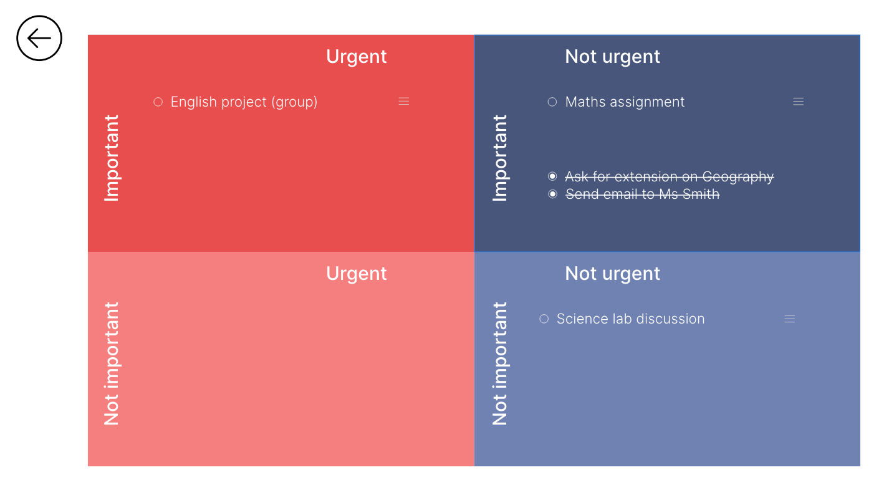
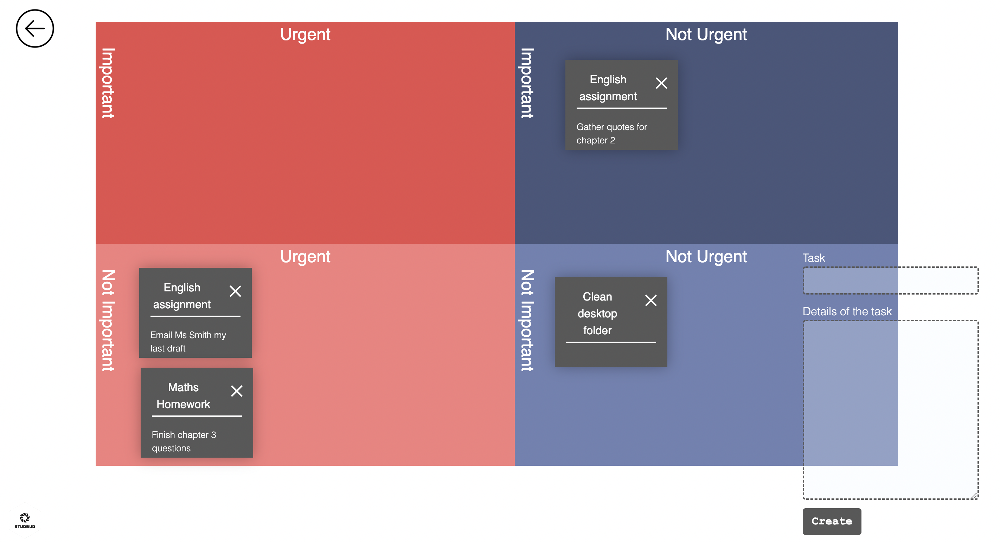
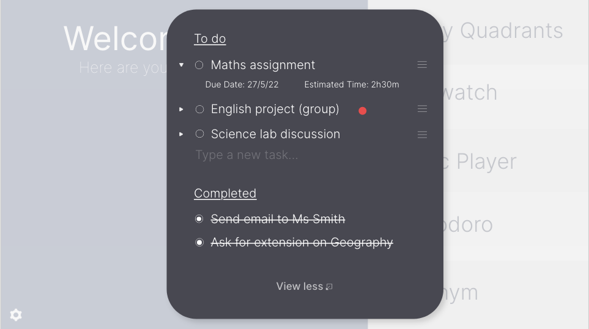
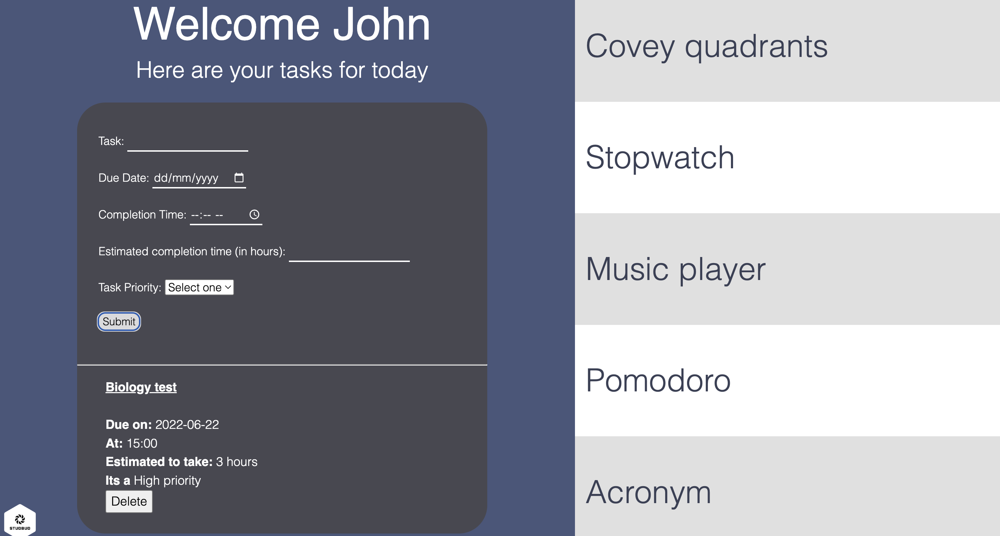
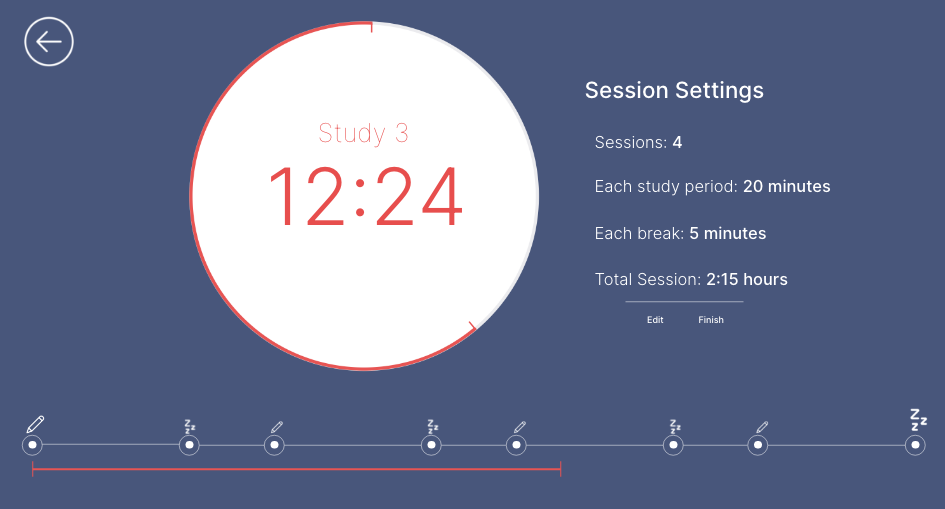
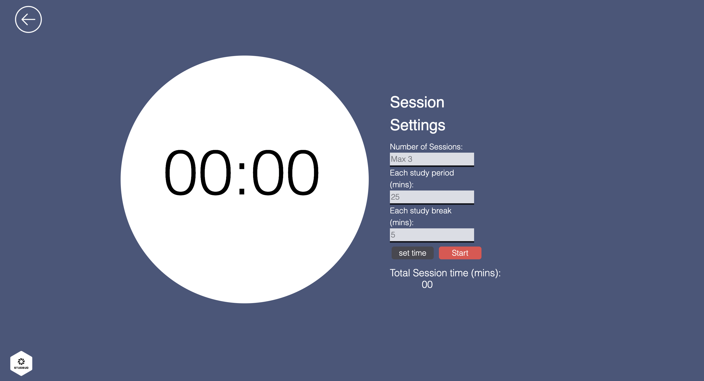
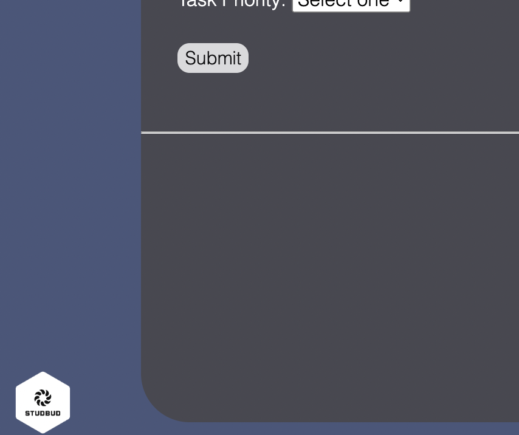

# STUDBUD - IGRO0534

## Task Management

### Covey quadrants

One iteration made to my website was the inclusion of sticky notes for the covey quadrants. These sticky notes are not derived from the users tasks but are rather inputted manually by the user on each study session. The reason for this is based on further user research where one participant described, "[you could add] maybe something that helps organise everything for a single study session, rather than so long-term" (Jess, 19). As such, the covey quadrants are designed for users to manually break up their big tasks into smaller, managable tasks to be completed in one study session. This is also the reason for the added space in the "details of the task" field.

|  |
|:--:|
|  |

### Task list

My taregt audience determined in assignment 2 were male university students who generally studied under 12 hours a week. Given the nature of my target audience, further iterations were made to the tasklist on my website. I had previously implemented a task list which showed basic information, and then popped out into a more comprehensive list when clicked on by the user. This action had to be taken to reveal important info such as due dates, task priority etc. Given accounts of students who study less than 12 hours about how they often struggle to have a simple task management system, after self-reflection it was decided to abandon the pop-up aspect of the task list. This way students do not have to "dig" for the extra information about their tasks; rather it is all on the home page.

|  |
|:--:|
|  |

## Time Management

### Pomodoro Timer

Upon further self-reflection it was decided to also drop the pomodoro timeline at the bottom of the pomodoro page. This was based on one user, Matthew, 19 who mentioned "there could be a lot of things moving around here". When probed further, it was uncovered that perhaps this bar could distract some users while they are trying to work.

|  |
|:--:|
|  |

## Content Management

### Added logo

Upon further self-reflection, it was noted that there was a small lack of consistency among all of the pages of the StudBud website in assignment 2. One solution which seemed to somewhat improve this lack of uniformity across pages was the addition of a StudBud logo. The presence of a consistent icon across each page improved the overall content of all pages on the website. This icon was also added as the favicon of each StudBud page. This also important for brand recognition and legitimacy of a website.

## Next Steps

### Hide terms/ shuffle on acronym

The next steps of my design which were unable to be completely satisfied in this version would be to get the 'hide terms' and 'shuffle' buttons of the acronym maker to be functional. There is some commented code in the acronym.html file and acronym.js file which could be a potential solution to getting a functional 'hide terms' button - although I could not get it working as of yet.

## Pomodoro circular timer

Another feature which I was unable to implement was the visual circular timer on the pomodoro clock. This was a feature which would certainly add a more dynamic and engaging feel to the website overall. This would especially be beneficial considering the absense of the pomodoro timeline down the bottom which a user could find potentially distracting.

## References

2022. Spotify. Spotify.

Codepen. 2022. CodePen Home Draggable Sticky Notes with Vanilla JS :). [online] Available at: <https://codepen.io/Annkay/pen/oNNdpmd> [Accessed 1 June 2022].

Ivanov, A., 2020. html/css segment screen into 4 quadrants. [online] Stack Overflow. Available at: <https://stackoverflow.com/questions/8101004/html-css-segment-screen-into-4-quadrants> [Accessed 13 May 2022].

Muchnick, M., 2018. How to add user input from a text box to a list in HTML. [online] Stack Overflow. Available at: <https://stackoverflow.com/questions/55123030/how-to-add-user-input-from-a-text-box-to-a-list-in-html> [Accessed 22 May 2022].

Tirri, G., 2020. Youtube. [online] Youtube.com. Available at: <https://www.youtube.com/watch?v=oMwaMYwHkS8&t=370s> [Accessed 6 May 2022].

W3schools.com. 2019. How To Create A Split Screen. [online] Available at: <https://www.w3schools.com/howto/howto_css_split_screen.asp> [Accessed 8 May 2022].

W3schools.com. 2019. W3Schools online HTML editor. [online] Available at: <https://www.w3schools.com/howto/tryit.asp?filename=tryhow_css_circles> [Accessed 19 May 2022].

Webdev, L., 2019. [online] Youtube.com. Available at: <https://www.youtube.com/watch?v=vAEG6OVCass&t=670s> [Accessed 26 May 2022].